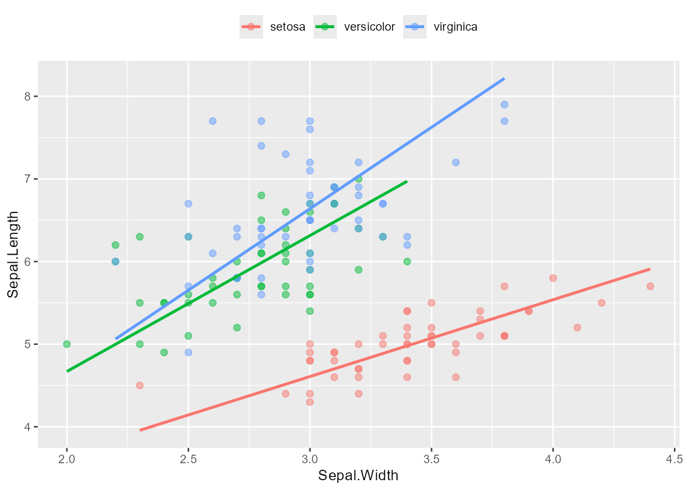
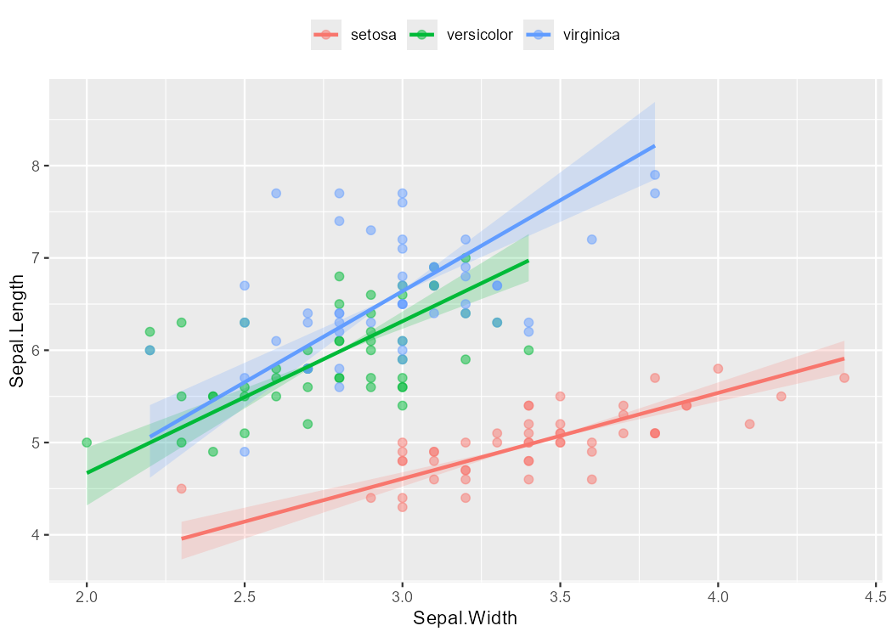

# ggsmatr

> An elegant extension of the [`smatr`](https://cran.r-project.org/web/packages/smatr/index.html) R package that leverages the **`ggplot2`** interface to create beautiful, publication-ready plots.

[](https://github.com/mariosandovalmx/ggsmatr)
[](https://github.com/mariosandovalmx/ggsmatr/releases)
[](LICENSE.md)

---

## Overview

`ggsmatr` brings together the power of **standardized major axis (SMA) regression** from the `smatr` package and the rich, customizable visualization capabilities of **`ggplot2`**. With just a few lines of code, you can generate clean, grouped scatter plots with fitted SMA lines and optional parametric confidence ribbons — perfect for exploratory analysis and scientific publications.

---

## Installation

Make sure you have the required dependencies installed, and then install `ggsmatr` from GitHub:

```r
install.packages(c("ggplot2", "smatr"))

# install.packages("devtools")
devtools::install_github("mariosandovalmx/ggsmatr")
```

---

## Quick Start

Here's a complete example using the classic **Iris** dataset.

### 1. Load the data

```r
datafile <- system.file("iris.csv", package = "ggsmatr")
df.iris  <- read.csv(datafile, encoding = "UTF-8")
```

### 2. Load the libraries and fit the SMA model

The confidence level of the ribbon is the one used in `sma()`, for example `alpha = 0.05` for 95% intervals.

```r
library(ggsmatr)
library(ggplot2)
library(smatr)

fit <- sma(
  Sepal.Length ~ Sepal.Width + Species,
  data      = df.iris,
  shift     = TRUE,
  elev.test = TRUE,
  alpha     = 0.05
)
```

### 3. Build the plot

```r
ggsmatr(
  data    = df.iris,
  groups  = "Species",
  xvar    = "Sepal.Width",
  yvar    = "Sepal.Length",
  sma.fit = fit
) +
  theme(
    legend.position = "top",
    legend.title    = element_blank()
  ) +
  ylab("Sepal.Length") +
  xlab("Sepal.Width")
```



### 4. Add a parametric confidence ribbon

SMA is not OLS, so `geom_smooth(se = TRUE)` is not related with the intervals stored in the `smatr` fit. Set `ci = TRUE` to draw a slope-CI envelope pivoted at each group centroid:

```r
ggsmatr(
  data    = df.iris,
  groups  = "Species",
  xvar    = "Sepal.Width",
  yvar    = "Sepal.Length",
  sma.fit = fit,
  ci      = TRUE
) +
  theme(
    legend.position = "top",
    legend.title    = element_blank()
  ) +
  ylab("Sepal.Length") +
  xlab("Sepal.Width")
```



The ribbon can be tuned with `ci.alpha` (transparency) and `n` (number of x values evaluated in each group):

```r
ggsmatr(
  data     = df.iris,
  groups   = "Species",
  xvar     = "Sepal.Width",
  yvar     = "Sepal.Length",
  sma.fit  = fit,
  ci       = TRUE,
  ci.alpha = 0.15,
  n        = 150
)
```

---

## Features

- **Seamless integration** with `ggplot2` — chain any layer or theme you like.
- **SMA regression lines** drawn automatically from a `smatr::sma()` fit.
- **Parametric confidence ribbons** for the SMA slope, using the intervals already computed by `sma()`.
- **Group-aware plotting** with consistent color mappings across points, lines and ribbons.
- **Fully customizable** — labels, themes, legends, and more.

---

## Related packages

| Package   | Purpose                                      |
|-----------|----------------------------------------------|
| `smatr`   | Standardized Major Axis regression           |
| `ggplot2` | Grammar-of-graphics plotting                 |
| `ggsmatr` | The bridge between the two                   |

---

## License

Released under the MIT License.
