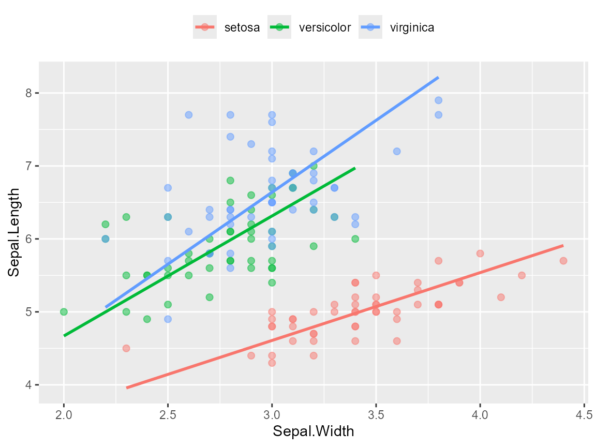
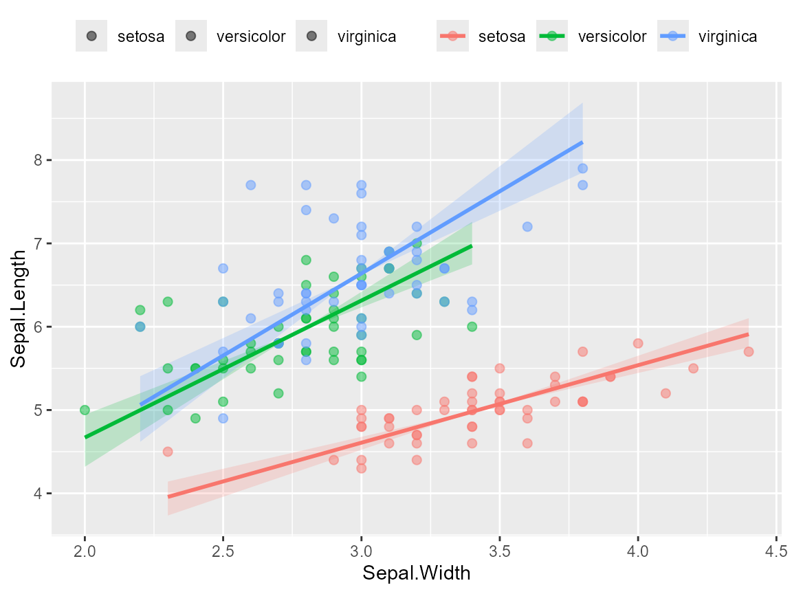

# ggsmatr example

\
[`library`](https://rdrr.io/r/base/library.html)`(`[`ggsmatr`](https://github.com/mariosandovalmx/ggsmatr)`)`\
`#> `\
`#> `\
`#> ##~~~~~~~~~~~~~~~~~~~~~~~~~~~~~~~~~~~~~~~~~~~~~~~~~~~~~~~~~~~~~~~~~~~~~~~~~~~~~~`\
`#> ##                            ggsmatr - R package                         ----`\
`#> ##~~~~~~~~~~~~~~~~~~~~~~~~~~~~~~~~~~~~~~~~~~~~~~~~~~~~~~~~~~~~~~~~~~~~~~~~~~~~~~ `\
`#> `\
`#> El paquete ggsmatr se ha cargado con éxito. ¡Espero que lo disfrutes!`\
`#>  Email de contacto: sandoval.m@hotmail.com `\
`#> Para citar este paquete: Mario A. Sandoval-Molina (2023). ggsmatr: a simple and efficient way to visualize the coefficients of the (Standardized) Major Axis Estimation fit. R package version 0.1.`\
[`library`](https://rdrr.io/r/base/library.html)`(`[`ggplot2`](https://ggplot2.tidyverse.org)`)`\
[`library`](https://rdrr.io/r/base/library.html)`(`[`smatr`](https://github.com/traitecoevo/smatr)`)`\
`#> Warning: package 'smatr' was built under R version 4.6.1`

## ggsmatr: Example using the iris dataset

The presence of fitted SMA lines in a ggplot2 scatter plot can be
obtained from an object created with
[`smatr::sma()`](https://traitecoevo.github.io/smatr/reference/sma.html).
We first read the example data included in the package and we fit a
common-slope SMA by group.

\
`datafile`` ``<-`` `[`system.file`](https://rdrr.io/r/base/system.file.html)`(``"iris.csv"``, package ``=`` ``"ggsmatr"``)`\
`df.iris`` ``<-`` `[`read.csv`](https://rdrr.io/r/utils/read.table.html)`(``datafile``, encoding ``=`` ``"UTF-8"``)`\
\
`fit`` ``<-`` `[`sma`](https://traitecoevo.github.io/smatr/reference/sma.html)`(`\
`  ``Sepal.Length`` ``~`` ``Sepal.Width`` ``+`` ``Species``,`\
`  data ``=`` ``df.iris``,`\
`  shift ``=`` ``TRUE``,`\
`  elev.test ``=`` ``TRUE``,`\
`  alpha ``=`` ``0.05`\
`)`

\
[`ggsmatr`](https://mariosandovalmx.github.io/ggsmatr/reference/ggsmatr.md)`(`\
`  data ``=`` ``df.iris``,`\
`  groups ``=`` ``"Species"``,`\
`  xvar ``=`` ``"Sepal.Width"``,`\
`  yvar ``=`` ``"Sepal.Length"``,`\
`  sma.fit ``=`` ``fit`\
`)`` ``+`\
`  `[`theme`](https://ggplot2.tidyverse.org/reference/theme.html)`(``legend.position ``=`` ``"top"``, legend.title ``=`` `[`element_blank`](https://ggplot2.tidyverse.org/reference/element.html)`(``)``)`` ``+`\
`  `[`ylab`](https://ggplot2.tidyverse.org/reference/labs.html)`(``"Sepal.Length"``)`` ``+`\
`  `[`xlab`](https://ggplot2.tidyverse.org/reference/labs.html)`(``"Sepal.Width"``)`\
`#>        group    r2  pval`\
`#> 1     setosa 0.551 0.000`\
`#> 2 versicolor 0.277 0.000`\
`#> 3  virginica 0.209 0.001`\
`` #> Warning: Using `size` aesthetic for lines was deprecated in ggplot2 3.4.0. ``\
`#> ``ℹ```  Please use `linewidth` instead. ``\
`#> ``ℹ`` The deprecated feature was likely used in the ``ggsmatr`` package.`\
`#>   Please report the issue to the authors.`\
`#> ``This warning is displayed once per session.`\
`#> ``` Call `lifecycle::last_lifecycle_warnings()` to see where this warning was ``\
`#> ``generated.`



## Confidence ribbons for SMA slopes

Given that SMA lines pass through the group centroid, the presence of a
parametric confidence ribbon can be added with `ci = TRUE`. The ribbon
uses the slope confidence intervals already stored in the
[`sma()`](https://traitecoevo.github.io/smatr/reference/sma.html) fit
(`Slope_lowCI` and `Slope_highCI`), and it is not related with the OLS
band of
[`geom_smooth()`](https://ggplot2.tidyverse.org/reference/geom_smooth.html).

The confidence level is the one used when the model is fitted, for
example `sma(..., alpha = 0.05)` for 95% intervals.

\
[`ggsmatr`](https://mariosandovalmx.github.io/ggsmatr/reference/ggsmatr.md)`(`\
`  data ``=`` ``df.iris``,`\
`  groups ``=`` ``"Species"``,`\
`  xvar ``=`` ``"Sepal.Width"``,`\
`  yvar ``=`` ``"Sepal.Length"``,`\
`  sma.fit ``=`` ``fit``,`\
`  ci ``=`` ``TRUE`\
`)`` ``+`\
`  `[`theme`](https://ggplot2.tidyverse.org/reference/theme.html)`(``legend.position ``=`` ``"top"``, legend.title ``=`` `[`element_blank`](https://ggplot2.tidyverse.org/reference/element.html)`(``)``)`` ``+`\
`  `[`ylab`](https://ggplot2.tidyverse.org/reference/labs.html)`(``"Sepal.Length"``)`` ``+`\
`  `[`xlab`](https://ggplot2.tidyverse.org/reference/labs.html)`(``"Sepal.Width"``)`\
`#>        group    r2  pval Slope Slope_lowCI Slope_highCI`\
`#> 1     setosa 0.551 0.000 0.930       0.767        1.128`\
`#> 2 versicolor 0.277 0.000 1.645       1.288        2.100`\
`#> 3  virginica 0.209 0.001 1.972       1.527        2.545`



Transparency and smoothness of the ribbon can be controlled with
`ci.alpha` and `n`:

\
[`ggsmatr`](https://mariosandovalmx.github.io/ggsmatr/reference/ggsmatr.md)`(`\
`  data ``=`` ``df.iris``,`\
`  groups ``=`` ``"Species"``,`\
`  xvar ``=`` ``"Sepal.Width"``,`\
`  yvar ``=`` ``"Sepal.Length"``,`\
`  sma.fit ``=`` ``fit``,`\
`  ci ``=`` ``TRUE``,`\
`  ci.alpha ``=`` ``0.15``,`\
`  n ``=`` ``150`\
`)`
